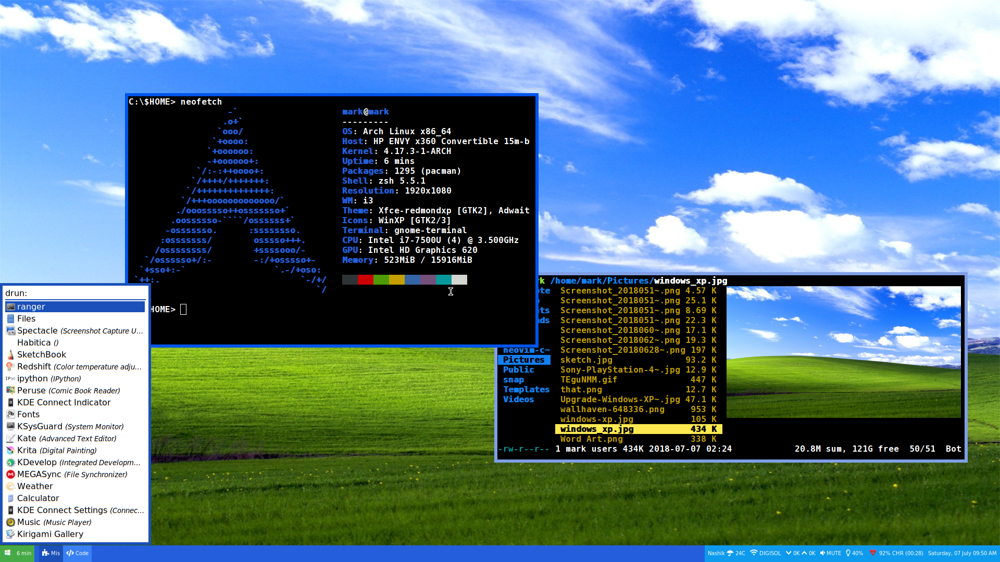

# Windows XP - i3wm

----
#### Pre-reqs:
* [i3 gaps](https://github.com/Airblader/i3)...obviously
* [rofi](https://github.com/DaveDavenport/rofi)
* [ranger](https://github.com/ranger/ranger)
* [feh](https://feh.finalrewind.org)
* [w3m](https://www.archlinux.org/packages/extra/x86_64/w3m/) to preview images in ranger
* [Python-PyWal](https://github.com/dylanaraps/pywal)
* [Betterlockscreen](https://github.com/pavanjadhaw/betterlockscreen) and it's dependencies
* [compton](https://wiki.archlinux.org/index.php/Compton) for smooth transitions
* [polybar](https://github.com/jaagr/polybar) and it's dependencies if you plan to use that.

#### Terminal:
* [gnome-terminal](https://aur.archlinux.org/packages/gnome-terminal-transparency/)
* [zsh](https://wiki.archlinux.org/index.php/zsh)
* [oh-myzsh](http://ohmyz.sh)

#### Scripts:
* [Weather](https://github.com/icemodding/i3/tree/master/scripts) 
script for i3blocks
* [Powermenu](https://github.com/vivien/i3blocks-contrib/tree/master/shutdown_menu) 
which uses rofi or zenity
* [Uptime](https://github.com/mohabaks/dotfiles/blob/master/config/polybar/.config/polybar/uptime)

Windows ZSH theme: https://github.com/juliavallina/windows-zsh-theme

----

#### Wallpaper:
If that's all you need...

